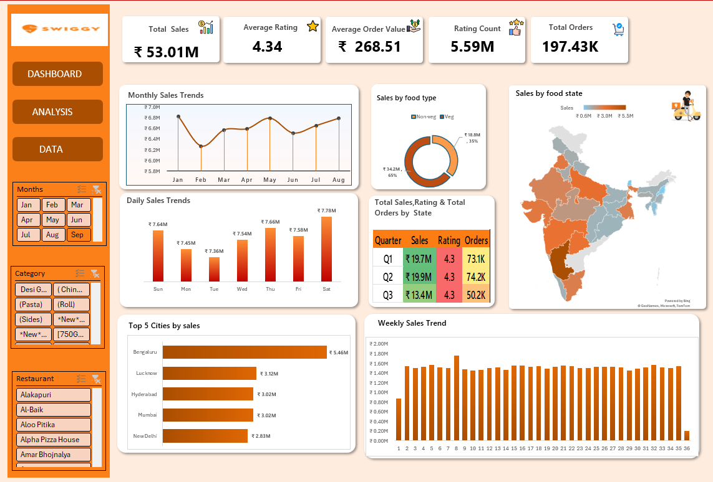
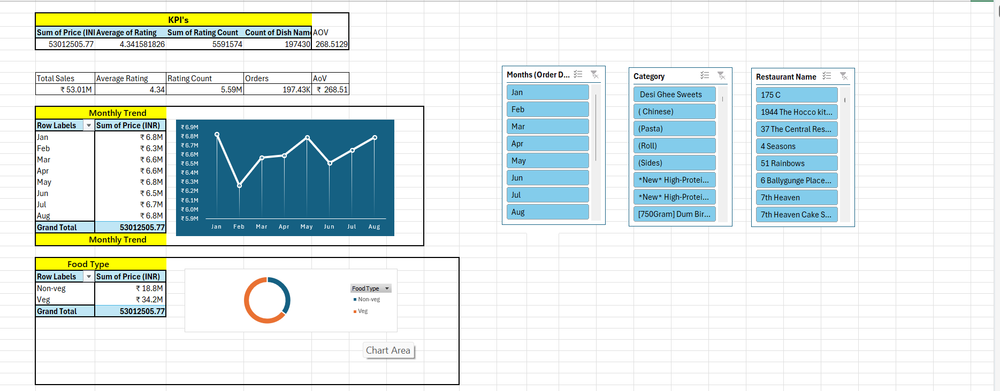
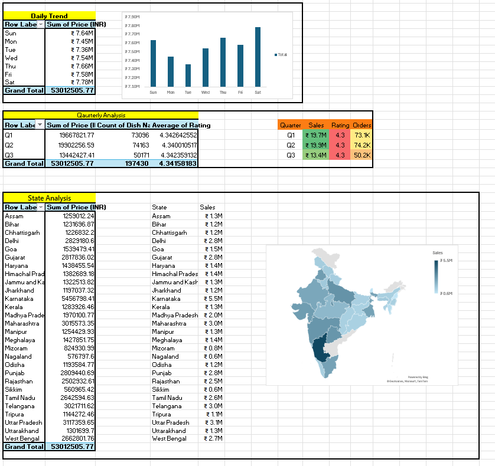
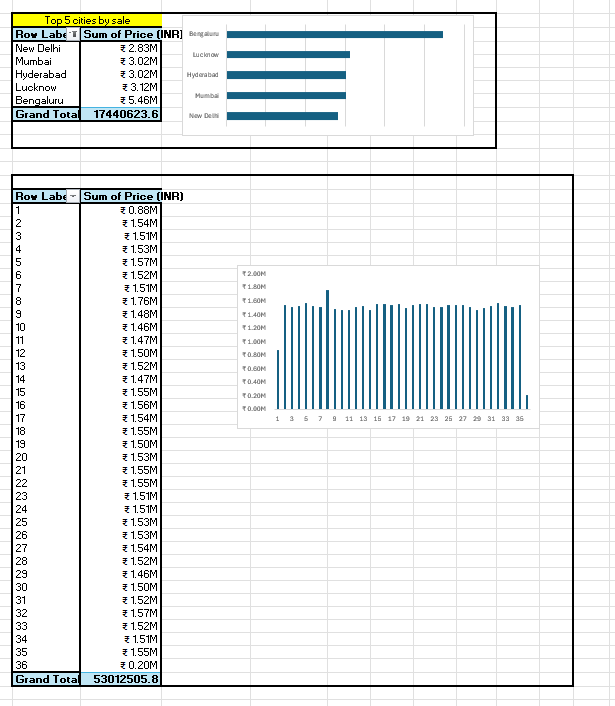

# 📊 Swiggy Sales Dashboard

An interactive **Swiggy Sales Dashboard** built using **Microsoft Excel** to analyze sales performance, identify trends, and generate business insights through interactive visualizations.

---

## 📌 Project Overview

This project demonstrates how Microsoft Excel can be used as a powerful Business Intelligence tool. The dashboard provides interactive sales analysis using Pivot Tables, Pivot Charts, Slicers, KPI Cards, and Map Charts.

---

## 🛠️ Tools Used

- Microsoft Excel
- Pivot Tables
- Pivot Charts
- Slicers
- Conditional Formatting
- Map Charts
- Data Cleaning
- Dashboard Design

---

## 📂 Project Structure

```text
Swiggy-Excel-Dashboard
│
├── Excel File/
│   └── Swiggy_Excel_Dashboard.xlsx
│
├── Demo/
│   ├── Dashboard_Demo.mp4
│   └── README.md
│
├── Images/
│   ├── Dashboard_Overview.png
│   ├── Monthly_Sales_Analysis.png
│   ├── State_and_Quarterly_Sales_Analysis.png
│   ├── City_and_Weekly_Sales_Analysis.png
│   └── README.md
│
└── README.md
```

---

## 🎯 Dashboard Features

- KPI Cards
- Monthly Sales Analysis
- Daily Sales Trend
- Weekly Sales Trend
- Quarterly Sales Analysis
- State-wise Sales Analysis
- Food Type Analysis
- Top 5 Cities Analysis
- Interactive Slicers
- Dynamic Dashboard
- Geographic Sales Map

---

## 📸 Dashboard Screenshots

### 1️⃣ Dashboard Overview



---

### 2️⃣ Monthly Sales Analysis



---

### 3️⃣ State and Quarterly Sales Analysis



---

### 4️⃣ City and Weekly Sales Analysis



---

## 🎥 Dashboard Demo

The dashboard demonstration video is available in the **Demo** folder.

**Path:**

```text
Demo/Dashboard_Demo.mp4
```

---

## 📈 Key Insights

- Total Sales reached **₹53.01M**.
- Average Customer Rating was **4.34**.
- Total Rating Count exceeded **5.59M**.
- Total Orders recorded were **197.43K**.
- Average Order Value (AOV) was **₹268.51**.
- Bengaluru generated the highest sales among the top five cities.
- Vegetarian food contributed a larger share of sales compared to non-vegetarian food.
- Sales remained relatively stable throughout the year with stronger performance during May and August.
- The dashboard supports interactive filtering by Month, Category, Restaurant, and Food Type.

---

## 💡 Skills Demonstrated

- Data Cleaning
- Data Analysis
- Dashboard Development
- Data Visualization
- Business Intelligence
- KPI Reporting
- Pivot Tables
- Pivot Charts
- Slicers
- Interactive Reporting
- Microsoft Excel

---

## 👩‍💻 Author

**Bhavanam Sri Jaya Sathwika**

- GitHub: https://github.com/sathwikae46
- LinkedIn: https://www.linkedin.com/in/bhavanam-sri-jaya-sathwika/

---

⭐ If you found this project helpful, consider giving it a **Star** on GitHub.
